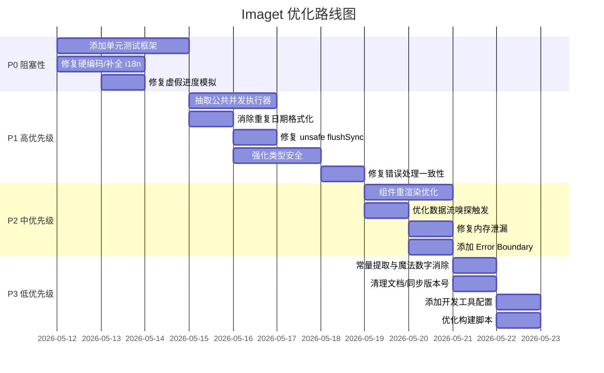

# Imaget 项目优化计划

> 创建时间：2026-05-11
> 分析范围：项目全部源代码（`src/`、`docs/`、构建配置）

---

## 🚫 约束说明

以下内容在优化过程中**禁止修改**：

| 禁止修改的内容 | 涉及文件 | 原因 |
|---------------|---------|------|
| 浮窗按钮（FloatingButton）的视觉外观、CSS 动画、过渡效果、颜色方案 | [`src/ui/components/FloatingButton.tsx`](src/ui/components/FloatingButton.tsx) | 用户手工调整好的设计，不允许变动 |
| 浮窗按钮在 [`floating-controller.tsx`](src/core/floating-controller.tsx) 中的 UI 渲染逻辑（`renderReact` 方法中的 JSX 结构和样式绑定） | [`src/core/floating-controller.tsx:160-233`](src/core/floating-controller.tsx:160) | 与外观样式直接相关 |

> **可改动范围**：浮窗按钮的**功能逻辑**（如虚假进度模拟、格式硬编码等非视觉行为）仍可优化，但改动不能影响按钮渲染结果的外观表现。

---

## 优先级说明

| 等级 | 含义 | 处理策略 |
|------|------|---------|
| P0 | **阻塞性** - 可能导致崩溃/数据丢失 | 立即修复 |
| P1 | **高优先级** - 明显影响功能/体验/质量 | 尽快处理 |
| P2 | **中优先级** - 优化改进 | 安排资源处理 |
| P3 | **低优先级** - 锦上添花 | 后续迭代 |

---

## 1. P0 - 阻塞性问题

### 1.1 缺少单元测试覆盖

- **位置**：项目全局
- **问题**：没有任何测试框架配置（无 Jest/Vitest），核心业务逻辑如 [`filterImages`](src/core/filter.ts)、[`convertImage`](src/core/utils/image-converter.ts)、[`generateFilename`](src/core/utils/filename-generator.ts) 等关键函数无法回归验证。
- **影响**：任何重构都有引入回归 bug 的风险。作为 Chrome 扩展，无测试意味着发布前只能靠手动测试。
- **建议方案**：
  1. 安装 Vitest（与 Vite 生态一致）
  2. 为纯函数（filter、filename-generator、image-type-detector）编写单元测试
  3. 为 adapter 接口编写 mock 测试
  4. 配置 `npm run test` 脚本并集成到 CI

### 1.2 硬编码文本且 i18n 键缺失

- **位置**：
  - [`ImageGrid.tsx:81`](src/ui/components/ImageGrid.tsx:81) - 硬编码中文 `"探索网页中的图片中..."`
  - [`SettingsPage.tsx:205`](src/ui/components/SettingsPage.tsx:205) - 硬编码中文 `"已保存"`
  - [`Header.tsx:65`](src/ui/components/Header.tsx:65) - `IMAGET` 标题未走 i18n
  - 多处使用 `t("labelXxx") || "xxx"` fallback 说明字典不完整
- **影响**：当用户使用非中文语言时，界面出现未翻译文本，影响国际化体验。
- **建议方案**：
  1. 在所有语言字典中添加缺失的 key
  2. 删除 `|| "xxx"` fallback，统一走 i18n 路径
  3. 添加 i18n 完整性校验脚本

### 1.3 浮窗控制器模拟进度

- **位置**：[`floating-controller.tsx:387-389`](src/core/floating-controller.tsx:387)
- **⚠️ 约束**：修改此问题**不能改变浮窗按钮的外观表现**（包括进度条动画样式、按钮尺寸、颜色、过渡效果等）。仅能更改进度数据的来源逻辑。
- **问题**：使用 `setInterval` 每 200ms 增加 5% 的固定增量模拟下载进度，不是真实进度。
- **影响**：用户看到的是虚假进度，可能导致困惑。进度到 95% 后停滞直到真正的下载完成。
- **建议方案**：
  1. 从 `downloadBatch` 的 `onProgress` 回调获取真实进度，替换掉 setInterval 模拟逻辑（仅改数据流，不改渲染样式）
  2. 或维持原 UI 不变，仅移除进度模拟改为从真实回调接收

---

## 2. P1 - 高优先级问题

### 2.1 重复的并发控制逻辑

- **位置**：[`processor.ts:21-145`](src/core/processor.ts:21) 和 [`processor.ts:150-273`](src/core/processor.ts:150)
- **问题**：`downloadBatch` 和 `downloadAsZip` 两个方法包含几乎相同的并发工作池模式（worker 函数、并发控制、进度回调、GIF 过滤）。差异仅在于一个是直接下载，一个是写入 ZIP。
- **影响**：维护成本高，修改并发策略需要同步两处。
- **建议方案**：抽取公共并发执行器，使用策略模式处理"处理单个 item"的逻辑差异。

### 2.2 日期格式化逻辑重复

- **位置**：[`filename-generator.ts:17-25`](src/core/utils/filename-generator.ts:17) 和 [`processor.ts:242-245`](src/core/processor.ts:242)
- **问题**：`filename-generator.ts` 和 `processor.ts` 中都有相同的日期格式化逻辑。
- **建议方案**：提取到共享的 date utils，或在 `filename-generator.ts` 中导出日期格式化函数供 `processor.ts` 使用。

### 2.3 flushSync 的不安全使用

- **位置**：[`ImageGrid.tsx:40-43`](src/ui/components/ImageGrid.tsx:40)
- **问题**：在 React 渲染过程中直接修改 state（`if (items !== prevItems)` 条件中调用 `setPrevItems` 和 `setVisibleCount`），违反了 React 的不变性和纯函数原则。
- **影响**：可能引起不稳定的渲染行为和 React 19 的严格模式警告。
- **建议方案**：使用 `useEffect` 或 `useMemo` 来处理 items 变化的响应逻辑。

### 2.4 类型安全缺失

- **位置**：
  - [`useSettings.ts:121`](src/ui/hooks/useSettings.ts:121) - `mergeDeep` 全面使用 `any`
  - [`useSettings.ts:140`](src/ui/hooks/useSettings.ts:140) - `isObject` 使用 `any`
  - [`content.tsx:167`](src/entry/content.tsx:167) - eslint-disable 注释掩盖类型问题
- **影响**：弱化了 TypeScript 的静态检查收益，运行时可能因类型不匹配崩溃。
- **建议方案**：
  1. `mergeDeep` 改为泛型 `mergeDeep<T>(target: T, source: Partial<T>): T`
  2. 逐步替换 `any` 为具体类型
  3. 在 eslint 配置中启用 `no-explicit-any` 为 error（而非 warn）

### 2.5 错误处理不一致

- **位置**：
  - [`sniffer.ts:297`](src/core/sniffer.ts:297) - `reject()` 无错误信息
  - [`background.ts:52`](src/entry/background.ts:52) - 多处空 catch 吞掉错误
  - [`sniffer.ts:29`](src/core/sniffer.ts:29) - `.catch(() => resolve())` 吞错误
- **影响**：问题难以追踪，开发者无法从日志中定位失败原因。
- **建议方案**：至少 `console.error` 错误信息，不要完全吞掉。

---

## 3. P2 - 中优先级优化

### 3.1 不必要的组件重渲染

- **位置**：[`ImageCard.tsx:423`](src/ui/components/ImageCard.tsx:423)
- **问题**：`ImageCard` 使用 `memo` 包裹，但其 props 中的 `onSelect`、`onPreview`、`onDownload` 回调在 [`App.tsx`](src/ui/App.tsx) 中未稳定化（没有 `useCallback`），导致 memo 失效。
- **影响**：列表中有大量图片时，每次渲染都会导致所有卡片重新渲染。
- **建议方案**：在 `App.tsx` 中使用 `useCallback` 包裹所有传给子组件的回调函数。

### 3.2 数据流可能导致不必要的重新嗅探

- **位置**：[`App.tsx:113`](src/ui/App.tsx:113)
- **问题**：`useEffect` 依赖 `[sniffer, settings]`，且没有对 settings 进行深层比较。任何 settings 变化（包括打字时的输入框值变化）都会触发重新嗅探。
- **影响**：用户在设置页面操作时，触发频繁的嗅探请求，浪费性能。
- **建议方案**：只监听 settings 的关键字段变化，或使用 `useRef` 存储是否需要重新嗅探的标志。

### 3.3 内存泄漏风险

- **位置**：
  - [`sniffer.ts:292-300`](src/core/sniffer.ts:292) - Image 对象未显式置 null
  - [`image-converter.ts:70-143`](src/core/utils/image-converter.ts:70) - canvas 和 Image 未清理
- **影响**：批量处理大量图片时可能导致内存占用持续增长。
- **建议方案**：在 `onload`/`onerror` 回调中显式清理 `imgElement.src = ""` 或 `URL.revokeObjectURL`。

### 3.4 浮窗控制器格式硬编码

- **位置**：[`floating-controller.tsx:407`](src/core/floating-controller.tsx:407)
- **问题**：下载时格式固定为 `"JPG"`，没有根据实际图片格式检测。
- **影响**：浮窗下载的图片格式标签不准确。
- **建议方案**：使用 `ImageTypeDetector` 从 URL 推断格式，或从 Image 元素获取自然格式。

### 3.5 Web 适配器下载 hack

- **位置**：[`web.ts:38`](src/core/adapters/web.ts:38)
- **问题**：使用 300ms 延时等待浏览器清理 blob URL，这是不可靠的时间依赖。
- **影响**：在慢速设备上可能提前释放 URL 导致下载失败。
- **建议方案**：
  1. 监听 `click` 事件后的 `focus` 事件作为完成信号
  2. 或使用下载完成后的用户交互作为清理时机

### 3.6 缺少 Error Boundary

- **位置**：[`App.tsx`](src/ui/App.tsx)
- **问题**：React 组件树没有 Error Boundary，如果某个组件渲染崩溃，整个 Shadow DOM 内的扩展会白屏。
- **影响**：极端情况下的 UI 崩溃无法恢复，用户必须刷新页面。
- **建议方案**：在 [`content.tsx`](src/entry/content.tsx) 的根渲染处添加 Error Boundary 组件。

---

## 4. P3 - 低优先级改进

### 4.1 魔法数字/硬编码常量

- **位置**：
  - [`sniffer.ts:45`](src/core/sniffer.ts:45) - 滚动间隔 `150`
  - [`sniffer.ts:33`](src/core/sniffer.ts:33) - 滚动距离 `400`
  - [`processor.ts:27`](src/core/processor.ts:27) - 默认并发数 `5`
  - [`sniffer.ts:157`](src/core/sniffer.ts:157) - SVG 最小尺寸 `16`
- **建议方案**：定义命名常量，提高可读性和可维护性。

### 4.2 文档残留 AI 对话文本

- **位置**：[`docs/PROJECT_DESIGN.md:106`](docs/PROJECT_DESIGN.md:106)
- **问题**：设计文档末尾有 `"我的错！刚才光顾着帮你解决最头疼的架构..."` 这样的 AI 对话残留。
- **建议方案**：清理文档中的非正式对话内容，保持文档的专业性。

### 4.3 设计文档与代码不一致

- **位置**：[`docs/PROJECT_DESIGN.md:13`](docs/PROJECT_DESIGN.md:13)
- **问题**：文档写 React 18，但 [`package.json:22`](package.json:22) 是 React 19。
- **建议方案**：同步文档版本号，或直接在文档中写"React（最新版）"避免版本漂移。

### 4.4 缺少开发工具配置

- **位置**：项目根目录
- **问题**：缺少 `.vscode/launch.json`（调试配置）、`.husky/`（pre-commit hooks）、`.github/workflows/`（CI/CD 配置）。
- **建议方案**：
  1. 添加 VS Code 调试配置，支持 content script 和 side panel 调试
  2. 配置 husky + lint-staged 保证提交质量
  3. 添加 CI workflow 运行 lint、type-check 和测试

### 4.5 项目构建脚本开销

- **位置**：[`package.json:14`](package.json:14)
- **问题**：`npm run build` 包含 `format` 和 `lint`，这些应该在 pre-commit 阶段运行而非构建时。
- **影响**：每次构建都需要运行 formatter 和 linter，增加构建时间。
- **建议方案**：拆分 `build` 和 `build:full`，快速构建跳过格式化和 lint。

---

## 5. 优化路线图

---

## 6. 实施建议

### 建议顺序

1. **先加测试框架**（P0） - 没有测试的情况下做任何重构都有风险
2. **修复硬编码和 i18n**（P0） - 影响用户体验，改动范围有限
3. **强化类型安全**（P1） - 降低后续修改风险
4. **抽取公共逻辑**（P1） - 为后续功能开发铺路
5. **性能优化**（P2） - 在架构稳住后进行

### 风险提示

- 合并 `downloadBatch` 和 `downloadAsZip` 的公共逻辑时，需要确保 ZIP 模式特有的 `zip.file()` 调用和最后的 `zip.generateAsync()` 不受影响
- 修改 `useSettings` 的类型安全时，需要确保 `chrome.storage` 序列化/反序列化的兼容性
- React 19 的 strict mode 在开发模式下会 double-invoke effects，需要确认现有代码的 effect 清理逻辑正确

---

*本计划基于 `git rev-parse HEAD`（当前最新提交）分析生成。实际执行时请同步到最新代码状态。*
